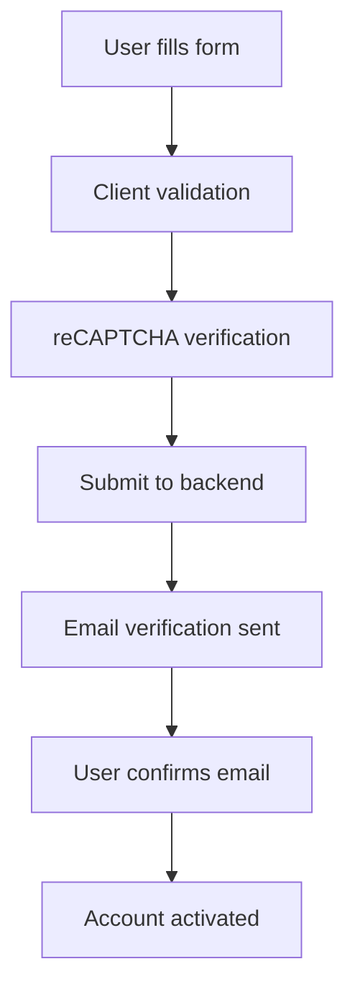
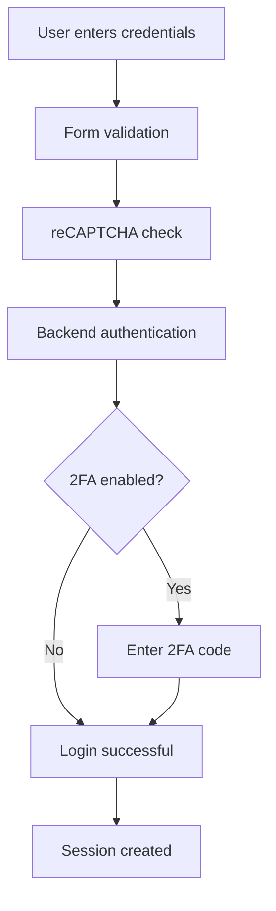
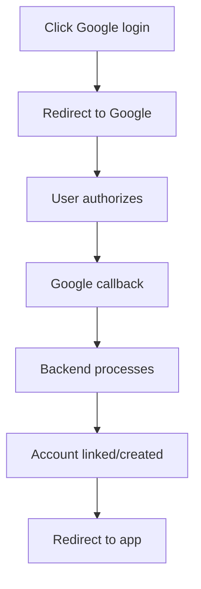

# Next.js Authentication Template - Frontend

<p align="center">
  
  
  
  
  
</p>

<p align="center">
  
  
  
  
</p>

<p align="center">
  <strong>A modern, production-ready Next.js frontend for authentication systems, built with Feature-Sliced Design architecture.</strong>
</p>

<p align="center">
  <strong>🔗 Pairs with <a href="https://github.com/andreyblck/nest-auth-template-backend">NestJS Auth Template Backend</a></strong>
</p>

> **⚠️ In Development:** This template is actively being developed. Features and documentation are updated frequently.

---

## 📑 Table of Contents

- [✨ Features](#-features)
- [🏃‍♂️ Quick Start](#️-quick-start)
- [📋 Prerequisites](#-prerequisites)
- [⚙️ Configuration](#️-configuration)
- [🎨 UI Components](#-ui-components)
- [🔐 Authentication Flow](#-authentication-flow)
- [🏗️ Architecture Guide](#️-architecture-guide)
- [🛠️ Development](#️-development)
- [🚀 Deployment](#-deployment)
- [🤝 Contributing](#-contributing)
- [📞 Support](#-support)

---

## ✨ Features

### 🎨 Modern Frontend Stack

- **Next.js 15** with App Router and Turbopack
- **React 19** with latest features
- **TypeScript** for type safety
- **Tailwind CSS 4** for styling
- **Radix UI** primitives for accessibility
- **Feature-Sliced Design** architecture

### 🔐 Authentication & Security

- **Login/Register Forms** with validation
- **Google reCAPTCHA** protection
- **Form Validation** with Zod schemas
- **Session Management** integration
- **OAuth Support** (Google)
- **Secure HTTP Client** with error handling
- **Type-safe API** interactions

### 🎯 User Experience

- **Responsive Design** for all devices
- **Toast Notifications** with Sonner
- **Loading States** and error handling
- **Password Visibility** toggle
- **Form Auto-completion** support
- **Accessibility** features built-in

### 🛠️ Developer Experience

- **Hot Reload** with Turbopack
- **ESLint & Prettier** configuration
- **Import Sorting** automation
- **Type Checking** with TypeScript
- **Custom Hooks** and utilities
- **Reusable Components** library

---

## 🏃‍♂️ Quick Start

### 1️⃣ Clone & Install

```bash
git clone https://github.com/andreyblck/next-auth-template-frontend.git
cd next-auth-template-frontend
pnpm install
```

### 2️⃣ Setup Environment

```bash
cp .env.example .env.local
# Edit .env.local with your configuration
```

### 3️⃣ Start Backend

Make sure the [NestJS backend](https://github.com/andreyblck/nest-auth-template-backend) is running on `http://localhost:4000`

### 4️⃣ Launch Frontend

```bash
pnpm dev
# 🚀 Frontend running at http://localhost:3000
```

**🎉 That's it! Your authentication frontend is ready.**

---

## 📋 Prerequisites

| Tool        | Version | Installation                                  |
| ----------- | ------- | --------------------------------------------- |
| **Node.js** | v18+    | [Download](https://nodejs.org/)               |
| **pnpm**    | v8+     | [Install Guide](https://pnpm.io/installation) |
| **Git**     | Latest  | [Install Git](https://git-scm.com/downloads)  |

**Backend Dependency:**

- [NestJS Auth Template Backend](https://github.com/andreyblck/nest-auth-template-backend) running on port 4000

---

## ⚙️ Configuration

### Environment Variables

<details>
<summary><strong>🔐 Authentication Settings</strong></summary>

| Variable                         | Description               | Default                 | Required |
| -------------------------------- | ------------------------- | ----------------------- | -------- |
| `NEXT_PUBLIC_RECAPTCHA_SITE_KEY` | Google reCAPTCHA site key | -                       | ✅       |
| `SERVER_URL`                     | Backend API URL           | `http://localhost:4000` | ✅       |

</details>

### Example .env.local File

```env
# Authentication
NEXT_PUBLIC_RECAPTCHA_SITE_KEY=your-recaptcha-site-key
SERVER_URL=http://localhost:4000
```

### Getting Google reCAPTCHA Keys

1. Go to [Google reCAPTCHA Console](https://www.google.com/recaptcha/admin)
2. Create a new site with reCAPTCHA v2 "I'm not a robot"
3. Add your domain (localhost for development)
4. Copy the **Site Key** to your environment file
5. Copy the **Secret Key** to your backend configuration

---

## 🎨 UI Components

### 🧩 Component Library

Built with **Radix UI** primitives and styled with **Tailwind CSS**:

| Component         | Description                           | Location    |
| ----------------- | ------------------------------------- | ----------- |
| **Button**        | Customizable button with variants     | `shared/ui` |
| **Input**         | Form input with validation            | `shared/ui` |
| **PasswordInput** | Password field with visibility toggle | `shared/ui` |
| **Form**          | React Hook Form integration           | `shared/ui` |
| **Card**          | Container component                   | `shared/ui` |
| **AuthWrapper**   | Authentication page layout            | `shared/ui` |
| **AuthSocials**   | Social login buttons                  | `shared/ui` |

### 🎨 Design System

```tsx
// Example component usage
import { Button, Card, Input } from "@/shared/ui";

<Card>
  <Input placeholder="Enter email" />
  <Button variant="primary" size="lg">
    Submit
  </Button>
</Card>;
```

### 🌈 Theming

- **Tailwind CSS 4** with custom configuration
- **CSS Variables** for consistent theming
- **Dark Mode** support (ready for implementation)
- **Responsive Design** breakpoints
- **Animation** utilities with `tw-animate-css`

---

## 🔐 Authentication Flow

### 📝 Registration Process



### 🔓 Login Process



### 🌐 OAuth Flow



---

## 🏗️ Architecture Guide

This project follows the **Feature-Sliced Design (FSD)** methodology for scalable and maintainable code organization.

### 📁 Project Structure

```
src/
├── app/                 # Next.js App Router
│   ├── (auth)/         # Authentication routes
│   ├── providers/      # App-level providers
│   └── styles/         # Global styles
├── widgets/            # Page compositions
│   └── auth/          # Authentication pages
├── features/           # Business logic features
│   └── auth/          # Authentication features
├── entities/           # Business entities
├── shared/            # Reusable utilities
│   ├── lib/          # Utilities and helpers
│   ├── ui/           # UI components library
│   └── utils/        # HTTP client and utilities
└── views/             # Page compositions
```

### 🎯 FSD Layer Rules

<details>
<summary><strong>📱 App Layer - Routes Only</strong></summary>

- Contains only Next.js route files
- Import and export widgets
- Handle metadata and layouts

```tsx
// ✅ Good: app/(auth)/auth/login/page.tsx
import { LoginPage } from "@/widgets/auth";

export default function LoginRoute() {
  return <LoginPage />;
}
```

</details>

<details>
<summary><strong>🧩 Widgets Layer - Page Compositions</strong></summary>

- Compose features into complete pages
- Handle page layout and structure
- Import from features and shared

```tsx
// ✅ Good: widgets/auth/login-page.tsx
import { LoginForm } from "@/features/auth";

import { AuthWrapper } from "@/shared/ui";

export function LoginPage() {
  return (
    <main className="flex h-screen items-center justify-center">
      <AuthWrapper heading="Login">
        <LoginForm />
      </AuthWrapper>
    </main>
  );
}
```

</details>

<details>
<summary><strong>⚡ Features Layer - Business Logic</strong></summary>

- Forms, API calls, business operations
- Feature-specific components
- Can import from shared and entities

```tsx
// ✅ Good: features/auth/login-form/ui/login-form.tsx
"use client";

export function LoginForm() {
  const handleSubmit = (e: React.FormEvent) => {
    e.preventDefault();
    // Business logic here
  };

  return <form onSubmit={handleSubmit}>{/* Form fields */}</form>;
}
```

</details>

<details>
<summary><strong>🔧 Shared Layer - Reusable Code</strong></summary>

- UI components without business logic
- Utilities, hooks, configs
- No imports from upper layers

```tsx
// ✅ Good: shared/ui/button.tsx
export function Button({ children, ...props }) {
  return <button {...props}>{children}</button>;
}
```

</details>

### 🔄 Import Rules

```
app/ → widgets/
widgets/ → features/, shared/
features/ → shared/, entities/
shared/ → (no upper layer imports)
```

---

## 🛠️ Development

### 🔧 Available Scripts

| Command             | Description                   |
| ------------------- | ----------------------------- |
| `pnpm dev`          | 🔥 Development with Turbopack |
| `pnpm build`        | 📦 Build for production       |
| `pnpm start`        | 🚀 Start production server    |
| `pnpm lint`         | 🔍 Run ESLint                 |
| `pnpm lint:fix`     | 🔧 Fix ESLint issues          |
| `pnpm format`       | ✨ Format with Prettier       |
| `pnpm format:check` | 📋 Check code formatting      |
| `pnpm type-check`   | 🔍 Run TypeScript checks      |
| `pnpm check`        | ⚡ Run all quality checks     |

### 📝 Code Quality

The project includes comprehensive code quality tools:

- **ESLint** for code quality and consistency
- **Prettier** for code formatting
- **TypeScript** for type safety
- **Import Sorting** with trivago plugin
- **Tailwind CSS** class sorting

### 🧪 Testing Strategy

```bash
# Future testing commands (planned)
pnpm test          # Run unit tests
pnpm test:watch    # Watch mode for development
pnpm test:e2e      # End-to-end tests
pnpm test:coverage # Test coverage report
```

### 🎨 Component Development

When creating new components:

1. **Follow existing patterns** in `shared/ui`
2. **Use TypeScript** for all components
3. **Implement proper error handling**
4. **Add form validation** where needed
5. **Follow accessibility guidelines**
6. **Document complex components**

### 🔄 Development Workflow

```bash
# 1. Start development server
pnpm dev

# 2. Make your changes
# 3. Check code quality
pnpm check

# 4. Commit changes
git add .
git commit -m "feat: add new component"
```

---

## 🚀 Deployment

### 🌐 Vercel Deployment (Recommended)

```bash
# Install Vercel CLI
npm i -g vercel

# Deploy to Vercel
vercel

# Set environment variables in Vercel dashboard
# - NEXT_PUBLIC_RECAPTCHA_SITE_KEY
# - SERVER_URL
```

### 🐳 Docker Deployment

```dockerfile
# Dockerfile example
FROM node:18-alpine AS base
WORKDIR /app
COPY package*.json ./
RUN npm install
COPY . .
RUN npm run build
EXPOSE 3000
CMD ["npm", "start"]
```

### 🏗️ Build Optimization

- **Bundle Analysis**: Use `@next/bundle-analyzer`
- **Image Optimization**: Next.js built-in optimization
- **Code Splitting**: Automatic with Next.js
- **Tree Shaking**: Enabled by default

---

## 🤝 Contributing

We welcome contributions! Here's how to get started:

### 🚀 Development Setup

1. **Fork** the repository
2. **Clone** your fork: `git clone <your-fork-url>`
3. **Install dependencies**: `pnpm install`
4. **Create feature branch**: `git checkout -b feature/amazing-feature`
5. **Start development**: `pnpm dev`
6. **Make your changes**
7. **Test your changes**: `pnpm check`
8. **Commit**: `git commit -m 'feat: add amazing feature'`
9. **Push**: `git push origin feature/amazing-feature`
10. **Open Pull Request**

### 📋 Contribution Guidelines

- **Follow** existing code style and patterns
- **Write** TypeScript for all new code
- **Test** your changes thoroughly
- **Update** documentation as needed
- **Keep** commits atomic and well-described
- **Follow** Feature-Sliced Design principles

### 🎯 Areas for Contribution

- 🎨 UI/UX improvements
- 🧪 Testing implementation
- 📱 Mobile responsiveness
- ♿ Accessibility features
- 🌍 Internationalization
- 📝 Documentation
- 🔧 Developer experience

---

## 📞 Support

### 🆘 Getting Help

1. **📖 Check Documentation** - Read this README thoroughly
2. **🔍 Search Issues** - Look through [existing issues](../../issues)
3. **💬 Ask Questions** - Create a [new issue](../../issues/new) with:
   - Clear description of the problem
   - Steps to reproduce
   - Environment details
   - Error messages/logs

### 🐛 Bug Reports

Please include:

- **Environment** (OS, Node.js version, browser)
- **Steps to reproduce**
- **Expected vs actual behavior**
- **Screenshots** if applicable
- **Error logs** from console
- **Configuration** (remove sensitive data)

### 💡 Feature Requests

We're always open to new ideas! Please include:

- **Use case** description
- **Proposed solution**
- **Alternative solutions** considered
- **Additional context** or mockups
- **Priority level** and reasoning

---

## 📄 License

This project is licensed under the **MIT License** - see the [LICENSE](LICENSE) file for details.

---

## 🔗 Related Projects

- **[NestJS Auth Template Backend](https://github.com/andreyblck/nest-auth-template-backend)** - The backend counterpart
- **[Feature-Sliced Design](https://feature-sliced.design/)** - Architectural methodology
- **[Next.js Documentation](https://nextjs.org/docs)** - Framework documentation
- **[Radix UI](https://www.radix-ui.com/)** - Component primitives
- **[Tailwind CSS](https://tailwindcss.com/)** - Styling framework

---

<p align="center">
  <strong>Made with ❤️ by the development team</strong>
</p>

<p align="center">
  <a href="#-table-of-contents">⬆️ Back to Top</a> |
  <a href="../../issues">🐛 Report Bug</a> |
  <a href="../../issues/new">💡 Request Feature</a>
</p>

---

**Happy coding! 🚀**
